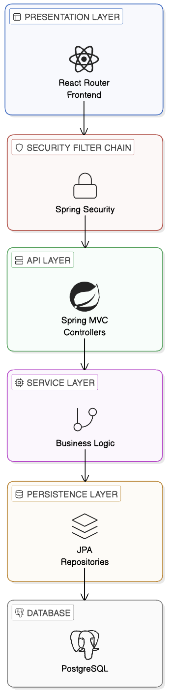
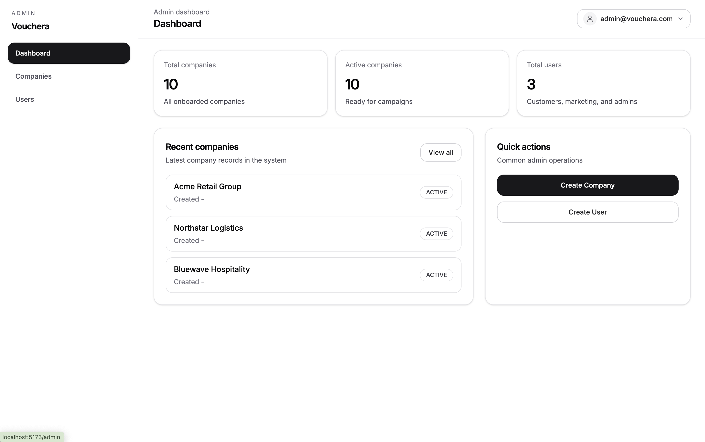
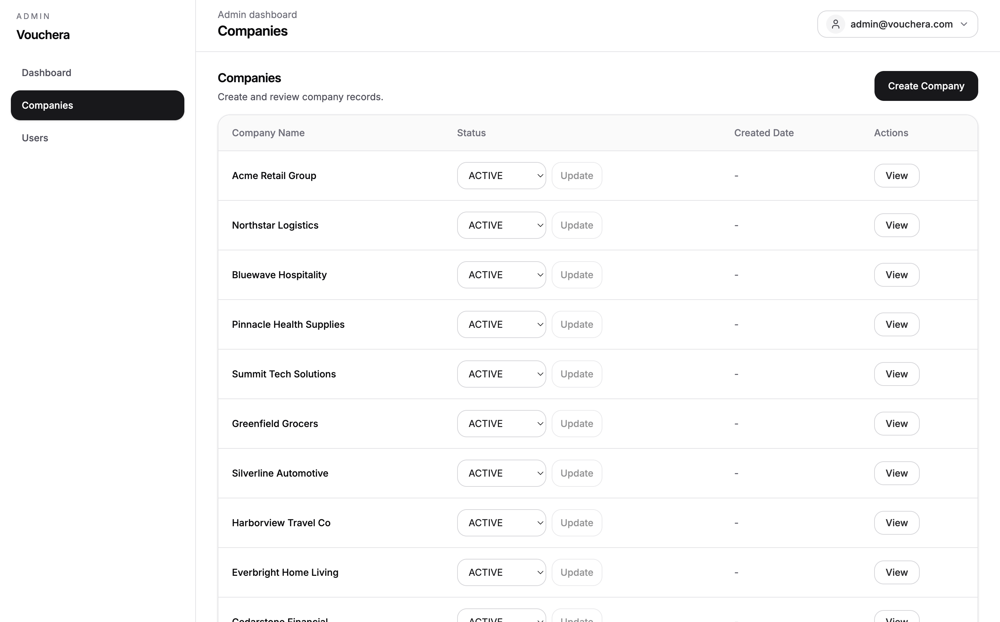
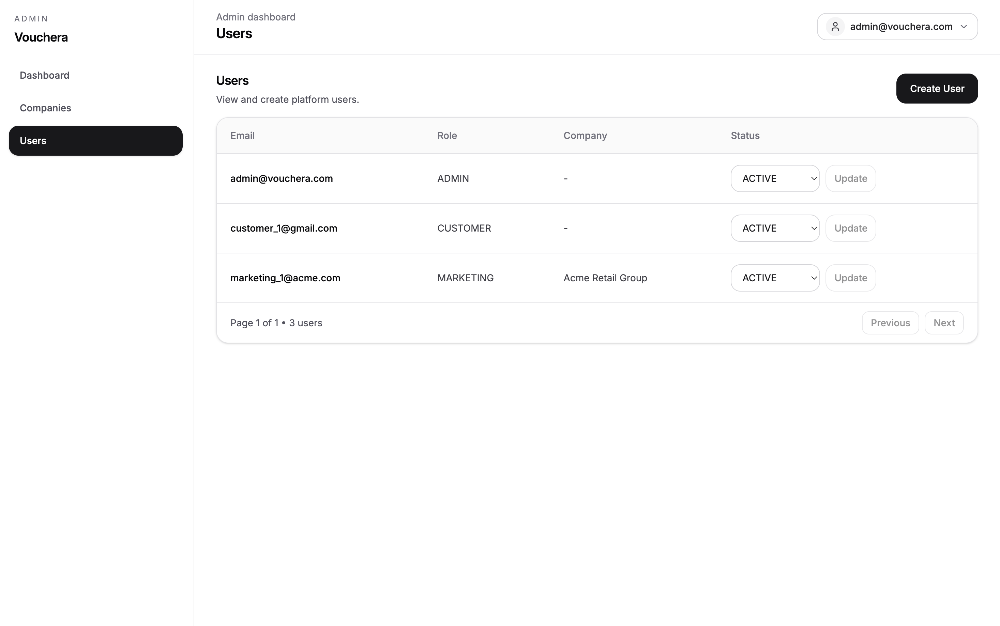
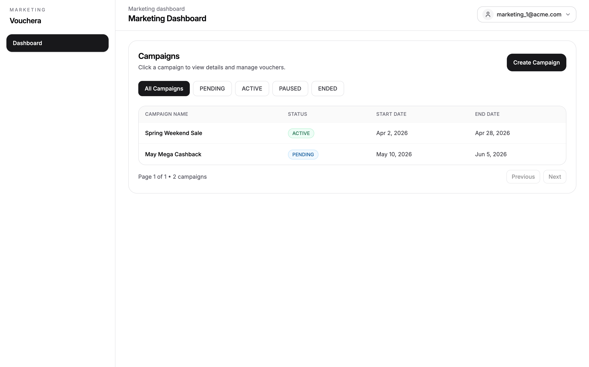
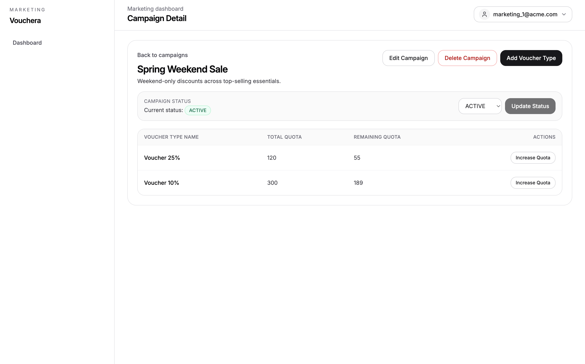
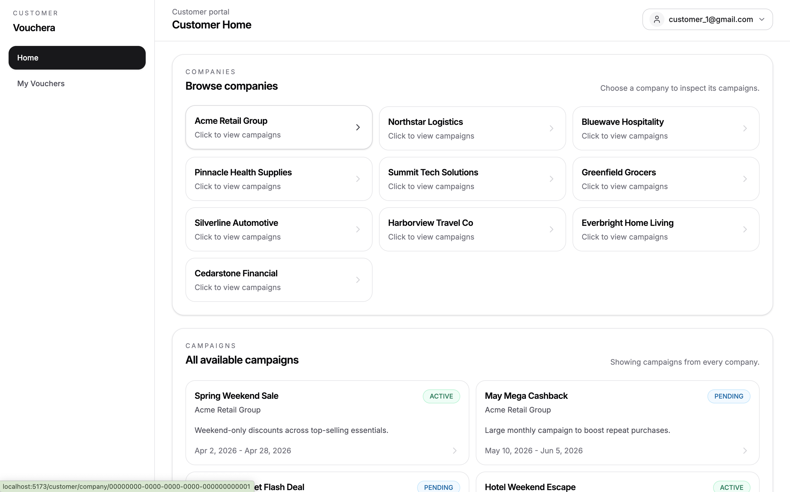
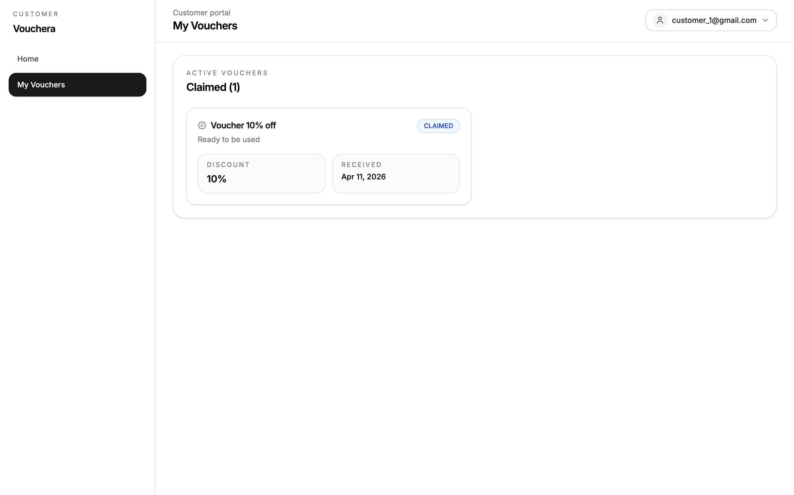

# Vouchera

Vouchera is a voucher campaign platform for managing companies, users, 
campaigns, and redemptions through role-based web workflows.

## Project Description

The system is split into a Spring Boot backend and a React Router frontend.

- **Admin** users manage companies and platform users.
- **Marketing** users manage campaigns for their own company.
- **Customers** browse campaigns and redeem vouchers.

Authentication uses session-based auth with CSRF protection.  
Data is persisted in PostgreSQL with schema migrations managed by Flyway.

## System Architecture Overview



---

## User Roles & Permissions

| Role | Permissions |
|------|-------------|
| ADMIN | Manage companies, manage users, update account and company status |
| MARKETING | Manage campaigns and voucher types for assigned company |
| CUSTOMER | Register, browse campaigns, redeem vouchers, view redemption history |

---

## Technology Stack

| Layer | Technologies |
|-------|-------------|
| Frontend | React 19, React Router 7, TypeScript, Tailwind CSS 4, shadcn/ui |
| Backend | Spring Boot 4, Spring Security, Spring Data JPA, Flyway |
| Database | PostgreSQL 17 |
| Tooling | Maven Wrapper, npm, Docker Compose, Nginx |

---

## Installation & Setup

### Prerequisites

- Java 23
- Node.js 20+
- PostgreSQL 17
- Docker and Docker Compose (optional)

### Environment Configuration

```bash
cp .env.example .env
```

Copy `.env.example` to `.env` and set:
- PostgreSQL credentials
- Backend and frontend ports
- Bootstrap admin credentials (`VOUCHERA_BOOTSTRAP_ADMIN_EMAIL`, `VOUCHERA_BOOTSTRAP_ADMIN_PASSWORD`)

### Quick Start with Docker

```bash
docker compose --env-file .env up --build
```

### Local Development

```bash
# 1. Create database
createdb vouchera

# 2. Start backend
cd backend
./mvnw spring-boot:run

# 3. Start frontend (new terminal)
cd frontend
npm install
npm run dev
```

---

## How to Run

| Step | Action |
|------|--------|
| 1 | Open `http://localhost:5173` |
| 2 | Register a customer account |
| 3 | Log in as admin with bootstrap credentials |

**Role-specific routes:**
- Admin: `/admin`, `/admin/companies`, `/admin/users`
- Marketing: `/marketing/dashboard`
- Customer: `/customer`

Backend API: `http://localhost:8080`

---

## Screenshots

### Admin
| Dashboard | Companies | Users |
|-----------|-----------|-------|
|  |  |  |

### Marketing
| Dashboard | Campaign Detail |
|-----------|----------------|
|  |  |

### Customer
| Home | My Vouchers |
|------|-------------|
|  |  |